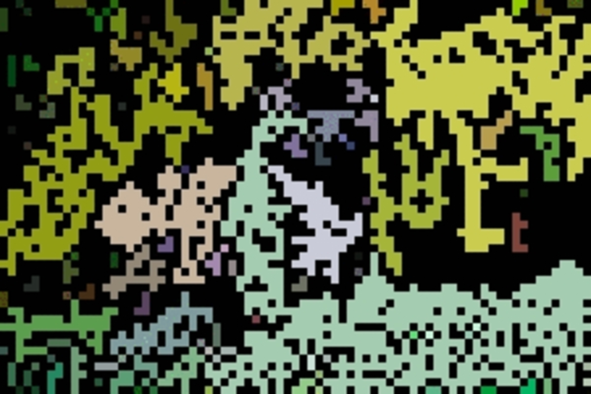
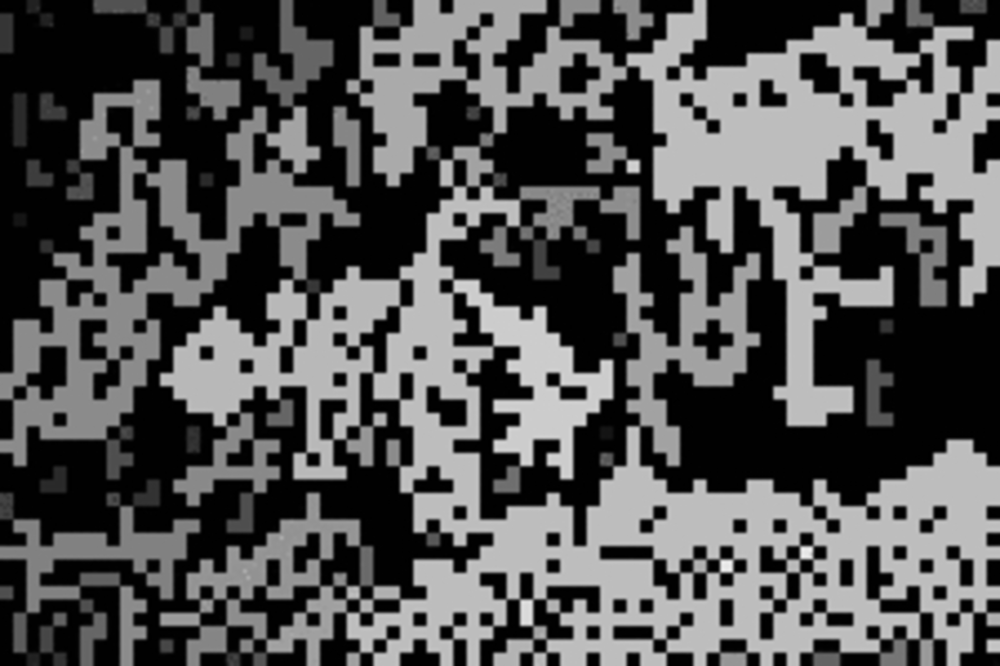

# Assignment 1: Report #

### CSCI 4625: Computer Vision (Fall 2024) ###

#### By: Sang Luong | Student ID: 105080763 ####

--- 

## Report: ##

**Overview** - 
The objective of this assignment was to process an 8-bit colored image by converting it to 
grayscale and applying different types of noise. These type of noises being white Gaussian noise and Salt 
and Pepper noise. We then implemented the following Box Filter, Median Filter, and Gaussian Filter to 
remove the noise while preserving the image. Then we experimented with varying the kernel size to observe its
effect on noise reduction and image quality. The tasks were designed to explore how different filters perform
under the different noise conditions and to highlight the trade-offs between noise reduction and image clarity.

---

### Converting an 8-bit Colored Image to Grayscale - ###

The first task was to convert an 8-bit colored image into a grayscale image by manually 
applying a formula that calculates brightness using the red, green, and blue color channels.

For a better understanding, an RGB image is made up of three channels Red, Green, and Blue. Each pixel 
in the image has three values corresponding to these color channels. To convert it into a grayscale image we 
applied a weighted sum of the RGB values. The conversion formula we used was:

$ GrayscaleValue=0.299×R+0.587×G+0.114×B $

This formula is supposed to reflect for the fact that the human eye is more sensitive to green than red or 
blue, which is why the green channel has the highest weight of 0.587. This means it contributes 58.7%. 

To approach this outcome I iterated through each pixel in the image, applied this formula, and created 
a new grayscale image where each pixel represents intensity instead of color. This conversion allowed us
to simplify the image while retaining brightness details that are important for subsequent tasks such as 
noise addition and filtering. If there was a challenge in this task, it would be was ensuring that the 
image's spatial dimensions remained consistent while converting from a 3-channel RGB image to a 
single-channel grayscale image. By iterating through each pixel and applying the formula, this makes the
task achieve this conversion without altering the resolution of the image.

**Results:**

|                   8bit Image                   |                      Grayscale Image                      |
|:----------------------------------------------:|:---------------------------------------------------------:|
|  |  |

___

### Adding White Gaussian Noise to the Grayscale Image - ###

Now, I was tasked to add white Gaussian noise to the grayscale image and observing the effects of noise 
with different standard deviations $(σ)$: 1, 10, 30, and 50. The overall outcome to notice was to see 
how increasing noise levels affect image quality.

To approach this, we need to understand how does Gaussian noise works. To begin, Gaussian noise follows a 
normal distribution, meaning most noise values are centered around 0, with fewer extreme values. The standard
deviation $(σ)$ controls how much the noise values vary from the mean. This means by varying $σ$, we can 
create different levels of distortion to the image.

We need to apply the following formula for each pixel in the grayscale image:

$ NoisyImage(x,y)=GrayscaleImage(x,y)+N(0,σ) $

Where:
- $𝑁(0,𝜎)$  is a Gaussian noise value with a mean of 0 and a standard deviation $σ$.
- The standard deviation $σ$ controls the spread of the noise

For the code, I used the NumPy library to generate these noise values and added them pixel by pixel to the
grayscale image ( "np.random.normal(mean, std_dev, shape", in Problem_2.py). After adding the noise, we used 
the np.clip() function to ensure that pixel values remained within the valid range [0, 255]. The following is
the results of the noise of different standard deviations:

- **Low noise (std_dev = 1):**
: Minimal noise, little changes to the image, not big enough to notice huge differences.

- **Moderate noise (std_dev = 10):** 
: Noticeable noise, causing slight blurring and graininess.

- **High noise (std_dev = 30):**
: Significant noise, with noticeable random variations in brightness across the image.

- **Very high noise (std_dev = 50):** 
: Severe noise, with highly noticeable random variation in brightness across the image.

**Results:**
(Please note that it is better to look at them by opening their respective files, as the noise is better seen
than on md)

|        Low Noise Image (Standard Deviation 1)         |    Medium Noise Image (Standard Deviation 10)    | 
|:-----------------------------------------------------:|:------------------------------------------------:|
|  |  | 

|     High Noise Image (Standard Deviation 30)     |  Very High Noise Image (Standard Deviation 50)   | 
|:------------------------------------------------:|:------------------------------------------------:|
|  |  | 

___

### Add Salt and Pepper Noise to the Grayscale Image - ###

Now, the next task was to add Salt and Pepper noise to 10% and 30% of the pixels in the grayscale image.
For Salt and Pepper noise, it randomly sets a percentage of the image's pixels to either 255 (white) or 0 (black). 
This is determined by probability which we can see in the code is one of the input the function takes. In addition,
is it multiplied by the value of 0.5 since, half the selected pixels are salt and the other half are pepper.
This is effective for simulating image pixel corruption in cases where transmission errors, and the values of those
corrupted pixel are substituted with white or black pixels. 

So, if we took steps to add Salt and Pepper noise to the grayscale image it will follow as:

1. Randomly selecting a set number of pixel coordinates to modify.
2. Assigning white (255) values to half of the selected pixels ("salt").
3. Assigning black (0) values to the other half ("pepper").

The two Salt and Pepper noise images created:

- 10% noise: A small fraction of the pixels were affected by noise.
- 30% noise: A larger fraction of the image was corrupted by random salt and pepper pixels.

|          Salt and Pepper Noise 10 Image           |            Salt and Pepper Noise 30 Image             |
|:-------------------------------------------------:|:-----------------------------------------------------:|
|  |  |

___

### Apply Filters to Remove Noise - ###

#### Kernel Size 3x3 - ####

Now, the task was to implement Box Filter, Median Filter, and Gaussian Filter to remove the Gaussian noise 
(std_dev = 50) and Salt and Pepper noise (30%) using a 3x3 kernel.

Three different filters were applied, each with a specific approach to reducing noise:

- Box Filter: This filter works by averaging all the pixel values in a 3x3 neighborhood. For this filter, 
each pixel in the output image is calculated as,
$ I_{out}(x,y)= \frac{1}{9} \sum_{i=1}^{1} \sum_{j=-1}^{1}I(x+i,y+j) $
Where $I(x,y)$ is the intensity of the pixel to the input image. This method works well for 
Gaussian noise but tends to blur edges.

- Median Filter: The filter takes the median value of the pixels in the 3x3 neighborhood. This filter is especially 
effective for Salt and Pepper noise, as it ignores extreme outlier values meaning completely black or white pixels.
The equation is,
$ I_{out}(x,y)= median {I(x+i,y+j)} $, where $I(x+i,y+j)$ represents the pixels intensities for the neighborhood.

- Gaussian Filter: this filter applies a weighted average, where the center pixels have the most weight, 
and the surrounding pixels contribute less according to a Gaussian distribution. That being:
$ G(x,y)=\frac{1}{2\pi \sigma ^{2}}e^{-\frac{x^{2}+y^{2}}{2\sigma ^{2}}} $ 
This filter is effective for Gaussian noise as it preserves edges while reducing noise.

Non-Trivial Step:

- Padding the image: We padded the image with zeros around the borders to ensure that the filtering 
operations could be applied uniformly across all pixels, including those at the edges of the image.
- Sigma Value for Gaussian Filter: The use of the sigma value in the Gaussian filter, is to control how much the 
neighboring pixels influence the center pixel. For this task, I choose a sigma value of 1 as it would be 
a balance between smoothing the noise and retaining important image features, such as edges. A larger 
sigma value would result in more aggressive smoothing, but with the small 3x3 kernel, sigma = 1 was an optimal 
choice to prevent excessive blurring.

Outcome:
Overall, the filters significantly reduced noise, but there was a trade-off in terms of blurring details. The Box 
Filter introduced the most blurring, while the Gaussian Filter was more edge-preserving.

(Again, I recommend opening the files if you are having a hard time seeing difference or noise in any of the images, 
the differences could be more noticeable)

**Filters on Noise Image:** 

|                 Very High Noise Image                  |                         Box Filter Image                          | Median Filter Image                                                        | Gaussian Filter Image                                                            |
|:------------------------------------------------------:|:-----------------------------------------------------------------:|----------------------------------------------------------------------------|----------------------------------------------------------------------------------|
|  |  |  |  |

**Filters on Salt and Pepper Noise Image:** 

|              Salt and Pepper Noise Image              |                      Box Filter Image                       | Median Filter Image                                                  | Gaussian Filter Image                                                      |
|:-----------------------------------------------------:|:-----------------------------------------------------------:|----------------------------------------------------------------------|----------------------------------------------------------------------------|
|  |  |  |  |

#### Kernel Size Varying - ####

Now, for our last task, we are varying the kernel size to 5x5 and 10x10 for each of the filters (Box, Median, Gaussian)
and evaluating the effects on noise reduction and image clarity.

When we  increase the kernel size, the filters operate over a larger neighborhood of pixels, leading to more aggressive 
noise reduction, but also a greater risk of blurring details.

**Results:** 

- Box Filters
: The formula for the Box Filter remains the same, but the size of the neighborhood increases. 
: For a 5x5 kernel:
: $ I_{out}(x,y)= \frac{1}{25} \sum_{i=1}^{1} \sum_{j=-1}^{1}I(x+i,y+j) $
: For a 10x10 kernel:
: $ I_{out}(x,y)= \frac{1}{100} \sum_{i=1}^{1} \sum_{j=-1}^{1}I(x+i,y+j) $
: As a result what we can notice is that, the larger kernels blur the image more effectively but also reduce sharpness.
In addition, as stated above we see that this filter works best for Gaussian noise.

|                 Very High Noise Image                  | Box Filter Image (Kernel Size 5x5)                                    |                  Box Filter Image (Kernel Size 10x10)                   |
|:------------------------------------------------------:|-----------------------------------------------------------------------|:-----------------------------------------------------------------------:|
|  |  |  |

|              Salt and Pepper Noise Image              | Box Filter Image (Kernel Size 5x5)                              |               Box Filter Image (Kernel Size 10x10)                |
|:-----------------------------------------------------:|-----------------------------------------------------------------|:-----------------------------------------------------------------:|
|  |  |  |

- Medium Filters
: Now, when using a larger kernel size with this filter, that means that the median is calculated from more pixels, thus
providing stronger noise reduction. As stated before, this is best for Salt and Pepper noise which can be seen in the 
image comparison.

|                 Very High Noise Image                  | Median Filter Image (Kernel Size 5x5)                                    |                  Median Filter Image (Kernel Size 10x10)                   |
|:------------------------------------------------------:|--------------------------------------------------------------------------|:--------------------------------------------------------------------------:|
|  |  |  |

|              Salt and Pepper Noise Image              | Median Filter Image (Kernel Size 5x5)                              |               Median Filter Image (Kernel Size 10x10)                |
|:-----------------------------------------------------:|--------------------------------------------------------------------|:--------------------------------------------------------------------:|
|  |  |  |

- Gaussian Filters
: With this filter at larger kernel sizes, the weight spreads out more meaning that that is going to be a stronger noise
reduction. However, this filter works better at preserving the edges than the box filter.

|                 Very High Noise Image                  | Gaussian Filter Image (Kernel Size 5x5)                                    |                  Gaussian Filter Image (Kernel Size 10x10)                   |
|:------------------------------------------------------:|----------------------------------------------------------------------------|:----------------------------------------------------------------------------:|
|  |  |  |

|              Salt and Pepper Noise Image              | Gaussian Filter Image (Kernel Size 5x5)                              |               Gaussian Filter Image (Kernel Size 10x10)                |
|:-----------------------------------------------------:|----------------------------------------------------------------------|:----------------------------------------------------------------------:|
|  |  |  |

---

### Conclusion: ###

To conclude, for this assignment, I looked at the effects of adding different two types of noise being Gaussian and 
Salt and Pepper to an image. In addition, applying various filtering techniques to remove this noise. I found that while
filtering techniques like the Box Filter, Median Filter, and Gaussian Filter are effective at reducing noise, but each
have trade-offs in terms of image blurring and preservation of details. Larger kernel sizes lead to stronger noise 
reduction but at the cost of losing image sharpness. The project demonstrated the importance of selecting appropriate 
filters and kernel sizes based on the type of noise present and the desired balance between noise removal and image 
clarity.

___

### README - ###

Instructions:
1. Start from Problem_1.py and work your way down and repeat the steps 3-5. 
2. Ensure image name is correct, if you want to use different image, just change path in, "image_color = cv2.imread('8bit_img.jpg')"
   (Please note, that the report uses the file name of the images I already generated, if you delete the images, my report won't have visuals.
 if so please run all py 1-5 for images again.)
3. Press run
4. Wait for program to apply filter, after filter is applied it will save the file in the root folder of the project.
5. Done!

---