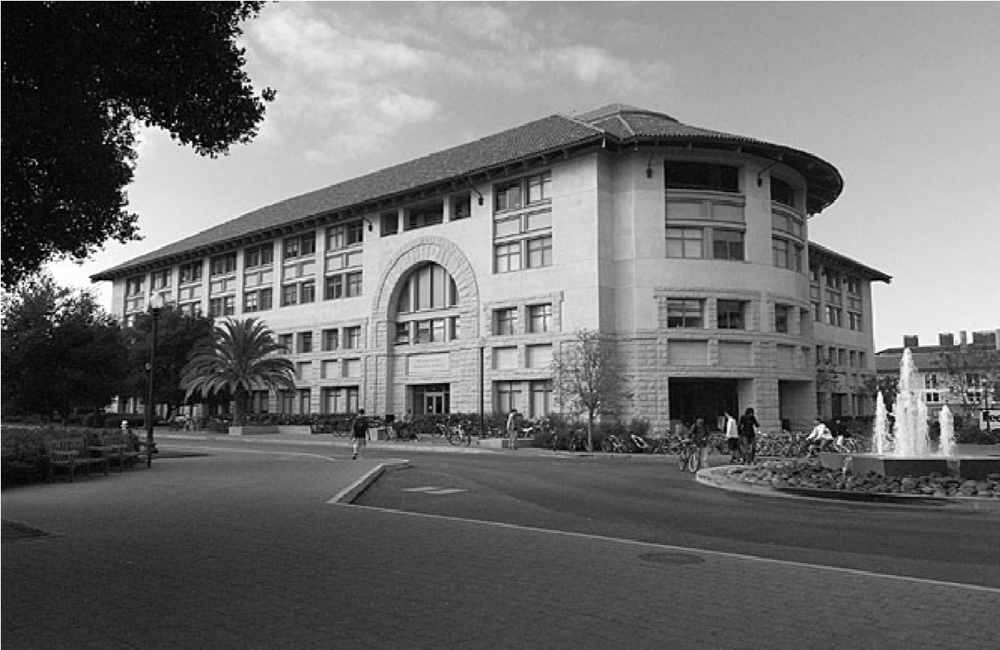
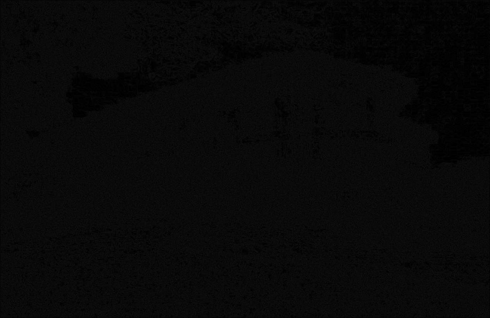
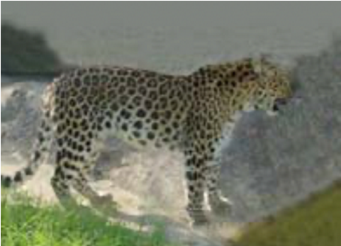
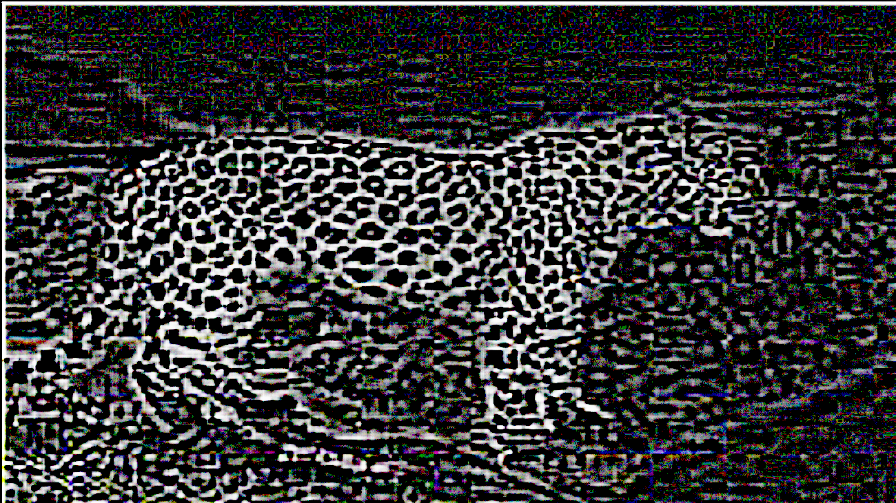
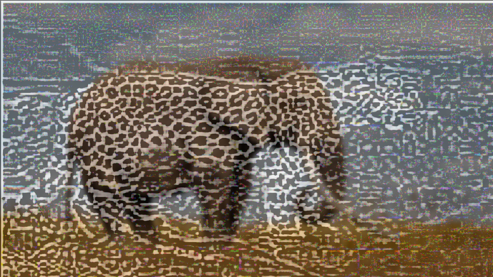

# **Assignment 2: Image Processing with Edge Detection and Hybrid Image Creation** #

### CSCI 4625: Computer Vision (Fall 2024) ###

___

## Overview - ##

This assignment explores two image processing techniques: edge detection and hybrid image creation using 
frequency filtering. Part A of the assignment focuses on identifying and emphasizing edges in a grayscale image without 
relying on advanced computer vision libraries. Part B utilizes both low-pass and high-pass filters to create a hybrid 
image from two source images, demonstrating how different frequencies influence image perception.

___

## Part A: Edge Detection ##

### Objective ###

The objective of Part A is to implement an edge detection algorithm without using specialized image processing 
libraries for calculations. Edge detection is critical in image processing as it reveals object boundaries and 
structural features, which are useful in tasks such as object recognition, segmentation, and feature extraction.

### Approach and Steps ###

1. **Gaussian Smoothing:**

   1. **Purpose:** Gaussian smoothing is applied to the image to reduce noise, which can interfere with accurate edge 
   detection. Noise often appears as high-frequency components, so blurring helps by reducing these undesired high 
   frequencies, resulting in a smoother image.
   
   2. **Method:** A 3x3 Gaussian kernel is used, defined as:
   $ Gaussian Kernel = \frac{1}{16}\begin{bmatrix} 1 & 2 & 1 \\ 2 & 4 & 2 \\ 1 & 2 & 1 \\ \end{bmatrix} $
   
   3. **Implementation:** The kernel is applied using a custom convolution function, which slides the kernel over each 
   pixel in the image, replacing each pixel value with a weighted average of its neighborhood.

2. **Sobel Filtering for Gradient Computation:**

   1. **Purpose:** After smoothing, we use Sobel kernels to compute the gradients of the image in the x and y 
   directions. Gradients here represent changes in intensity, with large gradients indicating edges.
   
   2. **Method:** Two 3x3 Sobel kernels are applied to the image:
   $ K_{x} = \begin{bmatrix}
   -1 & 0 & 1 \\
   -2 & 0 & 2 \\
   -1 & 0 & 1 \\
   \end{bmatrix} , K_{y}\begin{bmatrix}
   1 & 2 & 1 \\
   0 & 0 & 0 \\
   -1 & -2 & -1 \\
   \end{bmatrix} $
   
   3. **Implementation:**  The Sobel kernels are convolved with the smoothed image, producing two gradient images, 
   $G_{x}$ and $G_{y}$, which capture intensity changes in the horizontal and vertical directions, respectively.

3. **Gradient Magnitude Calculation:**

   1. **Purpose:** The gradient magnitude at each pixel represents the strength of an edge. By calculating the magnitude,
   we can create a single image that highlights edges regardless of their direction.
   
   2. **Method:** The gradient magnitude $G$ is computed as:
   $ G = \sqrt{Gx^2+Gy^2} $
   
   3. **Implementation:** After calculating the magnitude, the values are clipped to a displayable range (0–255) to 
   ensure compatibility with typical image formats.

### Why This Method Works ###
The combination of Gaussian smoothing and Sobel filtering effectively identifies edges in an image by focusing on areas 
of fast intensity change. The Gaussian filter removes noise, while the Sobel filter highlights areas of contrast, 
marking the edges. This approach is widely used in computer vision as it simplifies the image by retaining only 
essential structural information, facilitating further processing steps in object recognition, and scene understanding.

### Observed Result ###
The output, edges_detected.png, reveals the prominent edges in the image. The edges are highlighted as bright lines, 
while areas with minimal intensity change are dark. This method successfully emphasizes object boundaries and sharp 
features, making distinctions of edges.

|              Original Input Image              |                       Edge Detected Image                        |
|:---------------------------------------------:|:----------------------------------------------------------------:|
|  |  |

___

## Part B: Hybrid Image Creation ##

### Objective ###

The objective of Part B is to create a hybrid image that combines the low-frequency pass of one image and the 
high-frequency pass of another. The hybrid image then demonstrates how low and high frequencies affect perception 
differently, with low-frequency details dominating from a distance and high-frequency details becoming more visible up 
close.

### Approach and Steps ###

1. **Low-Pass Filter for Blurring (Image A):**

   1. **Purpose:** A low-pass filter is applied to imageA to retain only its low-frequency components. This filter 
   removes high-frequency details, resulting in a blurred version of the image that shows only broad shapes and color 
   gradients.
   
   2. **Method:** A Gaussian blur with a relatively large kernel size is used as the low-pass filter. It is good to 
   understand that the kernel size determines the degree of blurring, with larger sizes creating a smoother image.

   3. **Implementation:** The low-pass filtered image is produced by making imageA with a Gaussian kernel using 
   OpenCV’s GaussianBlur() function, resulting in low_pass_image.png.
   
2. **High-Pass Filter for Edge Emphasis (Image B which is technically "C", but I already worked with it named as B):**

   1. **Purpose:** A high-pass filter is applied to imageB to retain only its high-frequency features, which from 
   earlier would display edges and fine details. To be more accurate, this filter removes low-frequency content, leaving
   behind the sharp features that define the texture and boundaries in the image.
   
   2. **Method:** To create a high-pass filter, a blurred version of imageB is subtracted from the original image. 
   This subtraction isolates the high-frequency content by removing low-frequency components.
   
   3. **Contrast Enhancement:** To improve visibility, histogram equalization is applied to each color channel, 
   redistributing pixel intensities and enhancing contrast in the high-pass image. (The main reasoning is that my photo
   without this was not as detailed as the example photo provided, the image was almost just black. But this is mainly 
   optional.)
   
   4. **Implementation:** The high-pass image is created using OpenCV’s cv2.subtract() and cv2.equalizeHist() functions,
   resulting in high_pass_image.png.

3. **Combining Low-Pass and High-Pass Images to Create Hybrid Image:**

   1. **Purpose:** The final step combines the low-pass and high-pass images to produce a hybrid image. The hybrid image
   displays different characteristics depending on the viewer's distance: up close, high-frequency details are dominant,
   while from a distance, low-frequency details dominate.
   
   2. **Method:** The low-pass and high-pass images are combined using a weighted average to balance their contributions.
   
   3. **Implementation:** OpenCV’s cv2.addWeighted() function merges the two filtered images, resulting in hybrid_image.png.

### Why This Method Works ###

As humans, we interpret high and low frequencies differently based on viewing distance. High-frequency 
components (such as edges and fine textures) are more noticeable when viewed closely, while low-frequency components 
(broad shapes and colors) are easier to see from a distance. By combining the two, the hybrid image allows for a 
unique visual effect where the perceived image changes depending on how far the viewer stands from it. This technique 
can be seen used in artistic and scientific visualization, as well as in studies of visual perception. It demonstrates 
how the brain processes visual information hierarchically, prioritizing different spatial frequencies based on context.

### Observed Result ###

- **Low-Pass Image (low_pass_image.png):** This image appears smooth and blurry, showing only the general shapes and 
colors of imageA. Fine details are lost, making the image appear soft.

|             Image A              |                     Low Pass Image                     |
|:--------------------------------:|:------------------------------------------------------:|
|  |  |

- **High-Pass Image (high_pass_image.png):** This image emphasizes fine details, edges, and textures from imageB, 
creating a sharp, high-contrast version that captures only the high-frequency content.

|             Image B              |                      High Pass Image                      |
|:--------------------------------:|:---------------------------------------------------------:|
|  |  |

- **Hybrid Image (hybrid_image.png):** The combined image exhibits both low and high frequencies. When viewed up close,
the high-frequency details from imageB are dominant, while from a distance, the low-frequency content of imageA becomes 
more visible.

### Visual Interpretation of the Hybrid Image ###
The hybrid image leverages the visual system’s response to different spatial frequencies. Up close, the viewer perceives
sharp textures and edges, which are characteristic of high-frequency information. As the viewing distance becomes 
further, the high frequencies become less noticeable, and the image appears dominated by the low-frequency content, such
as general shapes and colors. This property of the hybrid image makes it an interesting application for visual studies 
and a compelling example of how image processing can alter perception.

___

## Conclusion ##
This assignment overviews two image processing techniques:

1. Edge Detection: An approach that identifies and emphasizes significant structures within an image. By combining 
Gaussian smoothing and Sobel filtering, we effectively capture edges, revealing essential image details and simplifying 
complex visual data.

2. Hybrid Image Creation: This technique demonstrates the power of frequency manipulation in images. By mixing low and
high frequencies from two images, the hybrid image creates a dual-perception effect. Thus, showing different visual 
elements based on distance. This application displays how frequency analysis can be applied in creative fields, as well 
as in scientific visualization and visual perception.

These techniques provide insights into how images can be processed, analyzed, and manipulated, with
applications. Through this assignment, we gain a deeper understanding of how different frequencies in an image 
contribute to visual perception and how edge detection can simplify images by retaining only essential information.

___

