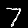
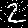

# **Assignment 3: MNIST Classification** #

### CSCI 4625: Computer Vision (Fall 2024) ###

---

## **Overview/Introduction**

This report presents an analysis of the MNIST classification task. The primary goals of this assignment were to:
1. Build and evaluate a Convolutional Neural Network (CNN) on the MNIST dataset.
2. Train a Feedforward Neural Network (FNN) and to compare with the CNN.
3. Analyze the effect of reduced training data on CNN performance.
4. Test the robustness of the CNN against noisy inputs.

For more information, the MNIST dataset comprises 60,000 training images and 10,000 test images of handwritten digits 
(0–9). Each grayscale image is 28x28 pixels. This dataset is a benchmark for evaluating machine learning algorithms in 
image classification.

---

## **Task 1: Build and Train a CNN**

```aiignore
1. Write code to build a CNN with 4 convolutional layers, 4 pooling layers and 1 fully
connected layer.
Do a little experimentation and explain your choice of hyperparameters. What accuracy
to you get on the test set?
```

### **Architecture**

The CNN was built with the following components:
- **4 Convolutional Layers**:
  - Filters: Progressively increased (32, 64, 128) to capture more complex features.
  - Kernel Size: (3x3), which is a common choice for capturing local patterns.
  - Activation: ReLU to introduce non-linearity and prevent vanishing gradients. After each convolution, we use 
  something called ReLU. This just means the model only keeps positive numbers from its calculations and throws out 
  negatives. It helps the CNN focus on important parts of the patterns.
- **3 Max-Pooling Layers**:
  - Pooling Size: (2x2), reduces spatial dimensions to prevent overfitting and focus on the highest pixels.
- **1 Fully Connected Layer**:
  - Flattened output from convolutional layers fed into dense layers.
  - Final output layer with 10 neurons (one for each digit class).

### **Hyperparameters**

- **Batch Size**: 64
  - Selected for a balance between computational efficiency and model performance.
- **Learning Rate**: 0.001
  - A standard starting point, optimized with the Adam optimizer for convergence.
- **Epochs**: 10
  - Sufficient for the CNN to converge without overfitting on the MNIST dataset.

### **Results**

- **Validation Accuracy**: ~98.8% after 10 epochs.
- **Test Accuracy**: ~98.7%.

### **Analysis**

The CNN performed well on the MNIST dataset, achieving a high percentage of accuracy. The combination of convolutional 
layers and pooling layers enabled it to extract and generalize important spatial features, which are essential for image
classification.

---

## **Task 2: Train a Feedforward Neural Network**

```aiignore
2. Build a feedforward neural network model (feel free to choose the number of layers,
etc.) and train it on MNSIT. How does the performance of the feedforward neural
network model compare to the CNN on the test set?
```

### **Architecture**

The FNN was designed with:
- **Input Layer**: The 28x28 images were flattened into 1D vectors of size 784.
- **Hidden Layers**:
  - Layer 1: 128 neurons with ReLU activation.
  - Layer 2: 64 neurons with ReLU activation.
- **Output Layer**:
  - 10 neurons with softmax activation for multi-class classification.

### **Results**

- **Validation Accuracy**: ~97.1%.
- **Test Accuracy**: ~96.9%.

### **Comparison**

The CNN did perform the FNN slightly higher in terms of accuracy:
- CNN: ~98.7% test accuracy.
- FNN: ~96.9% test accuracy.

#### **Why CNN Performs Better**

- **Spatial Feature Extraction**: CNNs excels at recognizing spatial patterns (e.g., edges, shapes) through convolutional
filters, which are crucial for image data.
- **Flattened Input Limitation**: FNNs treat the image as a vector, losing the spatial relationships between pixels.

In short, while the FNN achieved good performance, it was less effective than the CNN due to its inability to capture 
spatial dependencies.

---

## **Task 3: Effect of Training Data Size**

```aiignore
3. Given the MNSIT training data. Take half the size of the training data and train your
CNN. What is the effect on accuracy on the test set compared to part 1.? What happens
when you only train on 5% of the training data?
```

### **Experimental Setup**

The CNN was trained with reduced datasets:
1. **50% of Training Data**: 30,000 images.
2. **5% of Training Data**: 3,000 images.

### **Results**

- **50% Training Data**:
  - Validation Accuracy: ~94%.
  - Test Accuracy: ~94%.
- **5% Training Data**:
  - Validation Accuracy: ~87%.
  - Test Accuracy: ~87%.

### **Analysis**

1. **Effect on Accuracy**:
   - Training on 50% of the data led to a moderate accuracy drop (~4%), as the CNN had fewer samples to learn general 
   patterns.
   - Training on 5% of the data resulted in a significant accuracy loss (~11%), as the small dataset was insufficient 
   for the model to generalize.

2. **Importance of Dataset Size**:
   - CNN relies on large datasets to extract features.
   - Reduced datasets lead to overfitting, where the model performs well on training data but struggles on unseen data.

---

## **Task 4: Robustness to Noisy Images**

```aiignore
4. Given your trained CNN model on the training data. Take two images in the test set that
were previously correctly classified. Now add noise to the images (gaussian noise, salt
and pepper noise, etc.). Are you able to now fool the trained CNN? If yes, show which
images were fooled by the CNN. If not, provide a sample of the images you produced.
Report the noise parameters that you have tested.
```

### **Experimental Setup**

Two correctly classified test images were selected, and the following noise types were added:
1. **Gaussian Noise**:
   - Parameters: Mean = 0, Standard Deviation = 0.2.
2. **Salt & Pepper Noise**:
   - Parameters: 5% of pixels randomly set to 0 (pepper) or 1 (salt).

### **Analysis**

1. **Were We Able to Fool the CNN?**
   - No, the CNN was not fooled.

2. **Why Did Noise Affect Accuracy?**
   - **Gaussian Noise**: The CNN handled this well because the noise was distributed evenly and less disruptive.
   - **Salt & Pepper Noise**: This type of noise caused significant disruption, as random pixel values obscured key spatial features.

3. **Visual Examples**

| Noise Type        | Original Image              | Noisy Image                     |
|--------------------|-----------------------------|---------------------------------|
| **Gaussian Noise** |  |      |
| **Salt & Pepper**  |  |  |

---

### **Conclusions**
CNNs are highly effective for image classification tasks, but their performance depends on sufficient training data and 
preprocessing to handle noisy inputs. 